---
## 💖 Support This Project

If you found this helpful and want to support what I do, you can leave a tip here — thank you so much!

[](https://ko-fi.com/nicxx2)

---
# homeflow-task-manager

Plan tasks without overload. Built-in workload limits, smart scheduling, recurring task handling, and personal customization keep plans realistic and easier to follow.

---

## Screenshots

### Quick look

<table>
  <tr>
    <td align="center">
      <a href="images/Dashboard.jpg">
        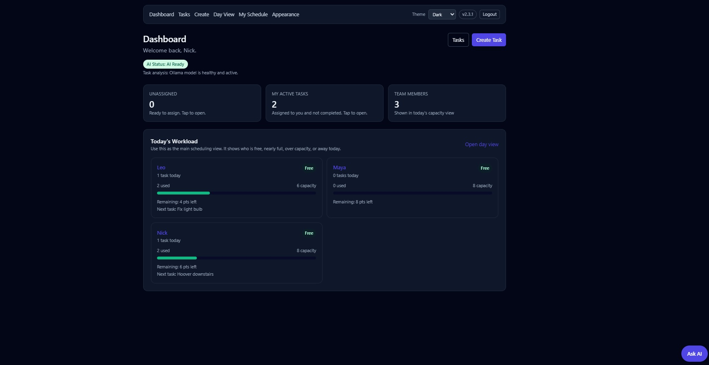
      </a><br>
      <sub>Dashboard overview</sub>
    </td>
    <td align="center">
      <a href="images/Tasks_View.jpg">
        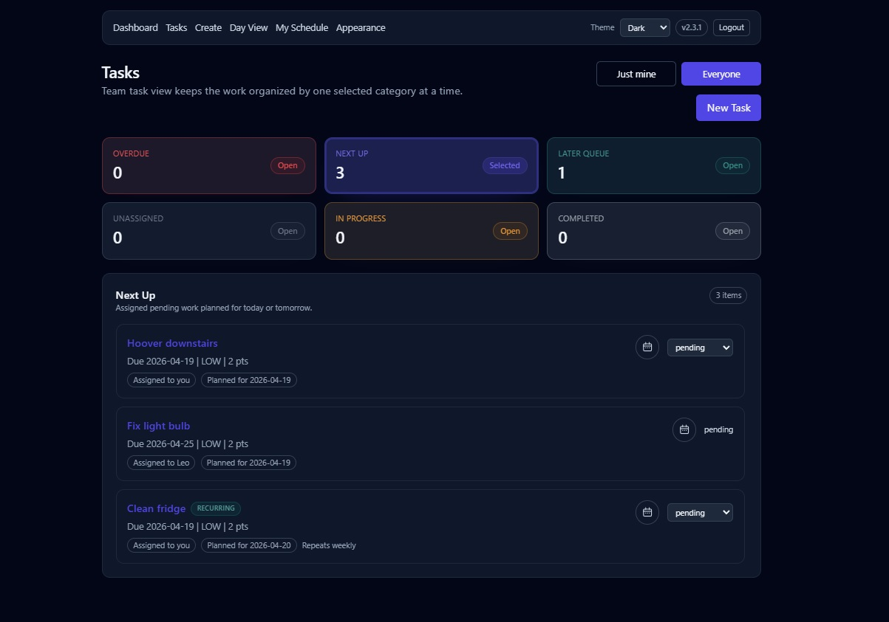
      </a><br>
      <sub>Tasks overview</sub>
    </td>
    <td align="center">
      <a href="images/Day_View.jpg">
        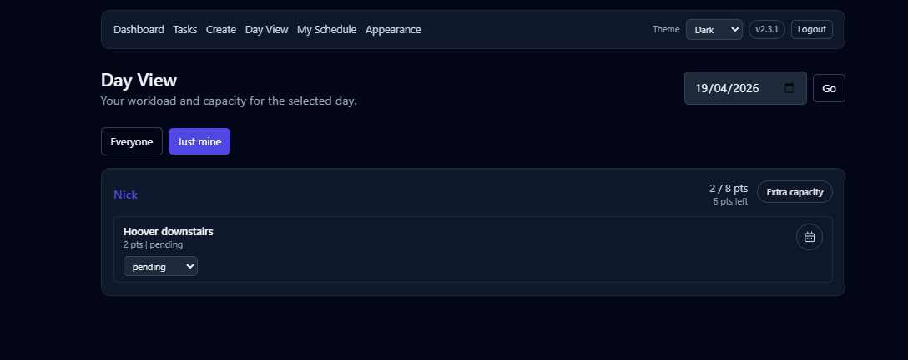
      </a><br>
      <sub>Day view with workload planning</sub>
    </td>
  </tr>
  <tr>
    <td align="center">
      <a href="images/Day_View_Change_Date_On_A_Task_Blocked_Schedule.jpg">
        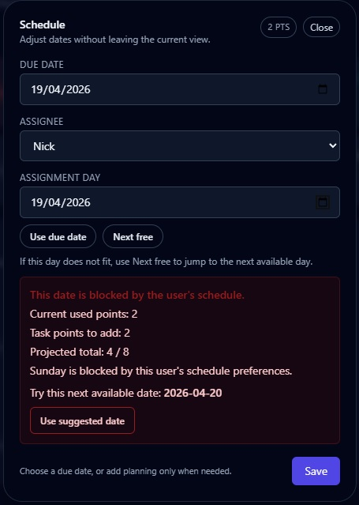
      </a><br>
      <sub>Blocked date with smart suggestion</sub>
    </td>
    <td align="center">
      <a href="images/Create_Assign_Now.jpg">
        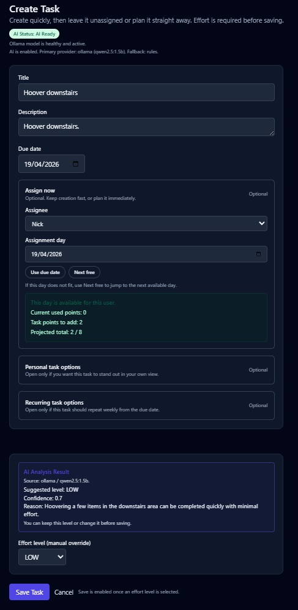
      </a><br>
      <sub>Create and assign in one flow</sub>
    </td>
    <td align="center">
      <a href="images/Ask_AI_Chat.jpg">
        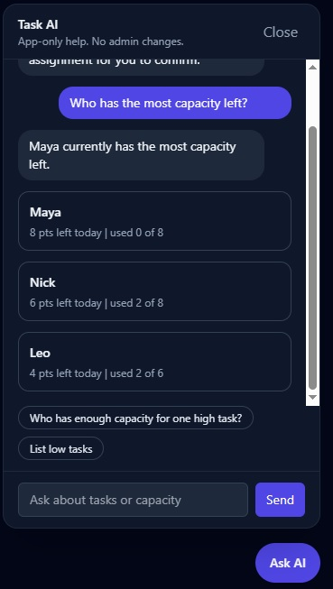
      </a><br>
      <sub>Built-in assistant</sub>
    </td>
  </tr>
</table>

<details>
  <summary><strong>View more screenshots ↓</strong></summary>
  <br>

  <h3>Additional task views</h3>

  <table>
    <tr>
      <td align="center">
        <a href="images/Tasks_View_In_Progress.jpg">
          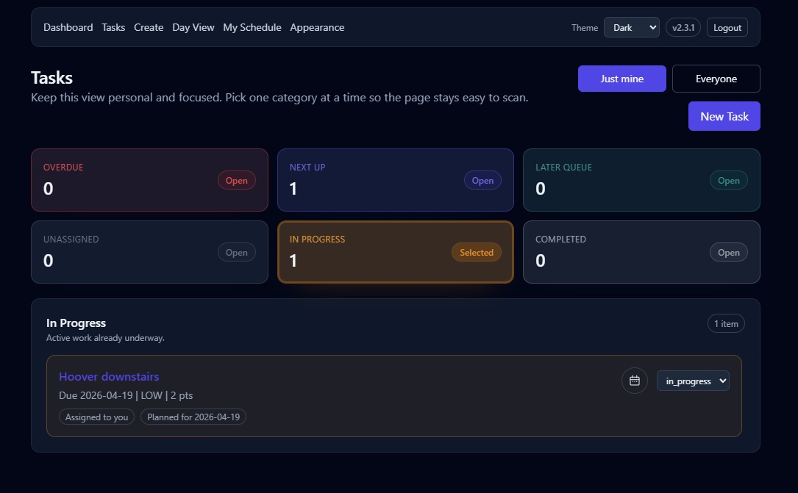
        </a><br>
        <sub>In progress tasks</sub>
      </td>
    </tr>
  </table>

  <h3>Task creation and recurring tasks</h3>

  <table>
    <tr>
      <td align="center">
        <a href="images/Create_Empty.jpg">
          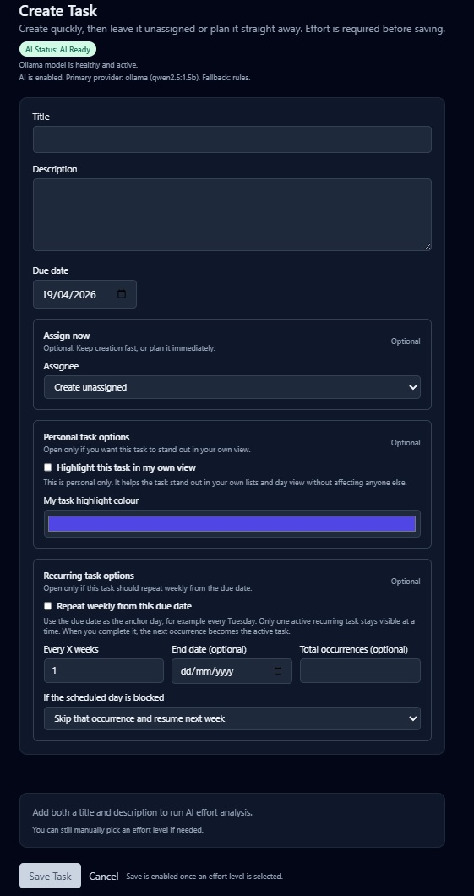
        </a><br>
        <sub>Task creation</sub>
      </td>
      <td align="center">
        <a href="images/Create_Recurring_Task_Options.jpg">
          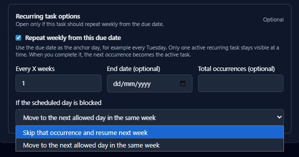
        </a><br>
        <sub>Recurring task options</sub>
      </td>
    </tr>
  </table>

  <h3>Scheduling details</h3>

  <table>
    <tr>
      <td align="center">
        <a href="images/Day_View_Change_Date_On_A_Task.jpg">
          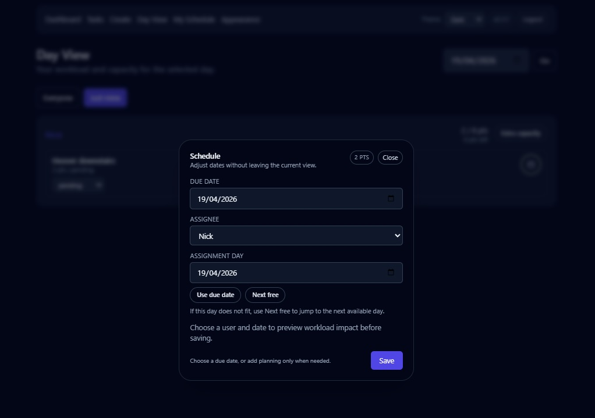
        </a><br>
        <sub>Change task date</sub>
      </td>
    </tr>
  </table>

  <h3>Personalization</h3>

  <table>
    <tr>
      <td align="center">
        <a href="images/My_Appearance.jpg">
          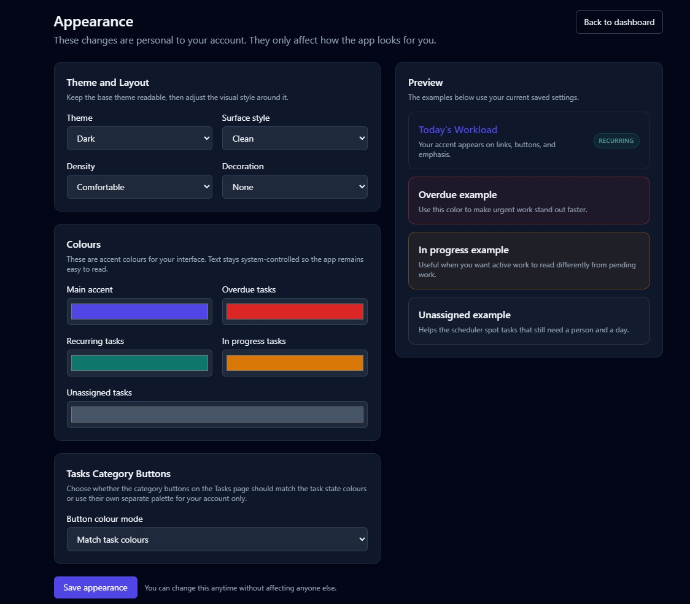
        </a><br>
        <sub>Appearance settings</sub>
      </td>
      <td align="center">
        <a href="images/My_Schedule.jpg">
          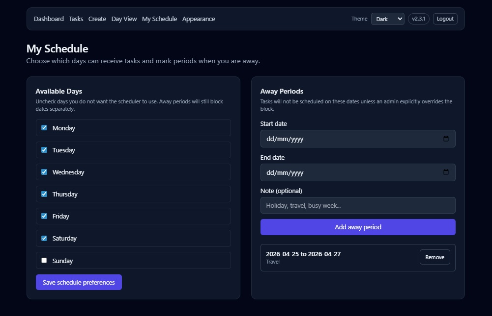
        </a><br>
        <sub>Schedule settings</sub>
      </td>
    </tr>
  </table>

  <h3>Admin settings</h3>

  <table>
    <tr>
      <td align="center">
        <a href="images/Admin_Settings_1.jpg">
          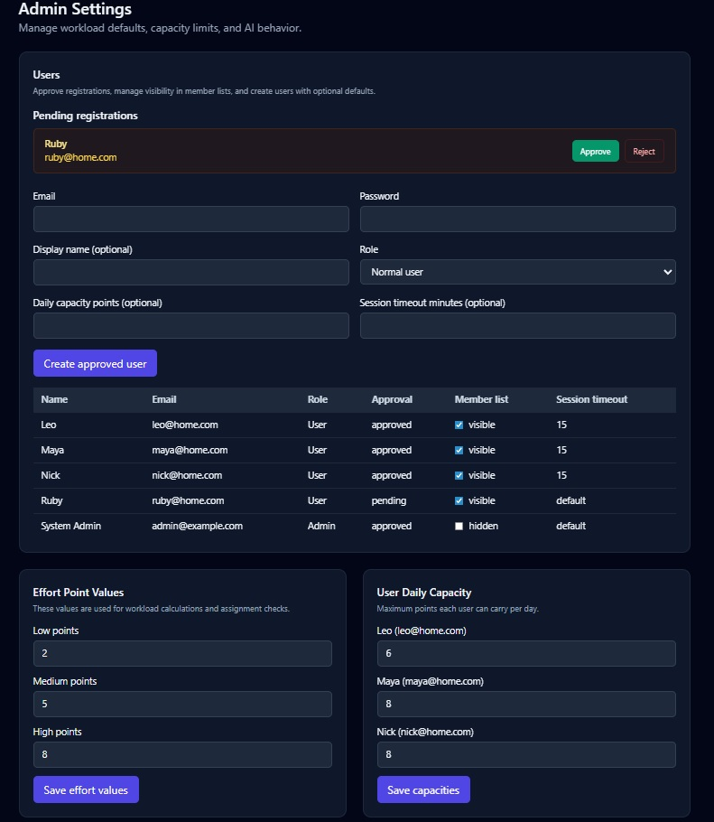
        </a><br>
        <sub>Admin controls</sub>
      </td>
      <td align="center">
        <a href="images/Admin_Settings_2.jpg">
          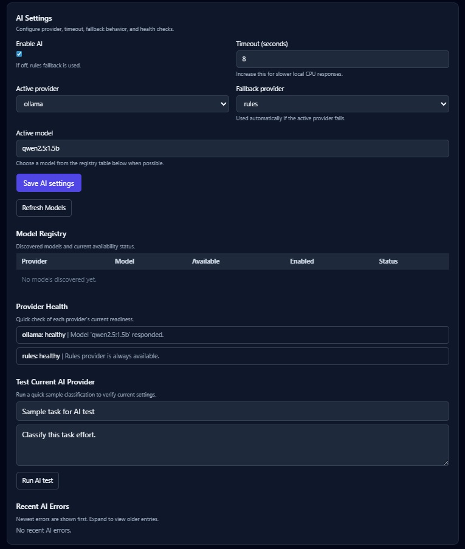
        </a><br>
        <sub>AI and configuration</sub>
      </td>
    </tr>
  </table>

  <h3>Login</h3>

  <table>
    <tr>
      <td align="center">
        <a href="images/Login_Page.jpg">
          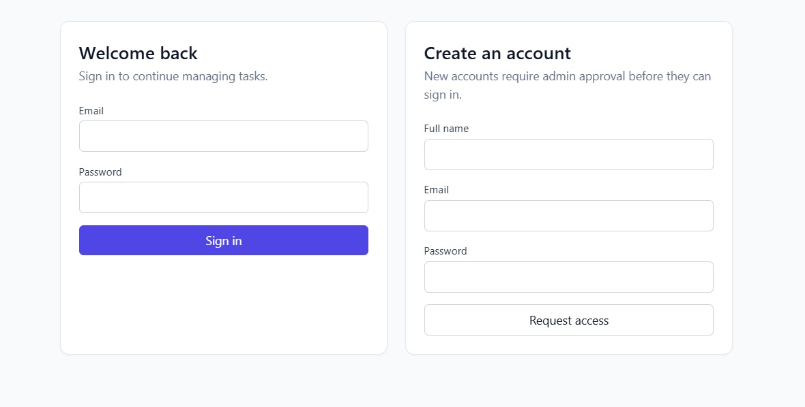
        </a><br>
        <sub>Login page</sub>
      </td>
    </tr>
  </table>

</details>

---

## What this is

A task manager for households and small teams.

It is designed to help people plan work realistically instead of just stacking tasks onto a list.

---

## Why this exists

Most task apps let you assign unlimited work to one day.

That can be difficult to keep up with in real life, so this app helps you stay balanced, plan realistically, and keep the app simple enough to use every day.

**Example:**

You assign 3 high-effort tasks to one day  
-> The app will not allow it  
-> It suggests the next available day automatically

If someone is away or has blocked days  
-> The app skips those dates  
-> It suggests the next valid day instead

---

## What is new in v2.5.4

- Web Easy Logon lets a trusted browser remember one approved profile per device, with a rolling 30-day expiry and a remove option.
- Web admins can optionally allow approved members to update visible task statuses while keeping edit, delete, assignment, and schedule controls unchanged.
- Recurring-task API input is limited to the supported weekly recurrence model, while every X weeks still works.
- Task creation now re-syncs AI-selected effort after the AI panel updates, so Save enables reliably.
- Mobile API handling now reports malformed server responses as normal API errors.
- Mobile Today is now assignment-date first, so active and completed work reflects what is planned for the signed-in user today.
- Completed mobile tasks no longer reappear later just because their due date arrives.
- Mobile overdue handling now stays clearer: tasks assigned today remain in Today, with a compact overdue label when their due date has already passed.
- Mobile task dates can now be adjusted quickly while connected to the server, with due date and assignment date controls built for the smaller mobile flow.
- Mobile scheduling uses backend capacity checks, next-available suggestions, and the same date rules as the web app: due dates can be in the past, but assignment dates cannot.
- Users can explicitly extend their own capacity for a selected day when adding a task would exceed available points.
- Offline status changes are queued locally and synced when the server is reachable again; date and capacity changes stay online-only so validation remains reliable.
- Mobile date picking and the date-edit sheet were polished for real devices, including calendar-day accuracy and bottom navigation safe-area spacing.
- Web overdue task cards now visually match the backend overdue rule, including tasks overdue by assignment date.

---

## What else is in Homeflow

### Web app

- Effort-based planning with daily workload protection
- Automatic next-available scheduling suggestions
- Quick status changes from list and day views
- Familiar create and edit flows for assignment planning
- Recurring task support with one active occurrence instead of cluttering the task list
- Admin controls for users, login access, registration defaults, capacity, visibility, and AI settings
- Personal UI customization without affecting other users

### Smart scheduling

The app is designed to plan around real-life availability, not just due dates.

- allows past due dates when you need to keep overdue work accurate
- prevents assignment to past dates
- avoids blocked weekdays and away periods
- checks daily capacity before assigning work
- suggests the next valid day when the chosen one does not fit
- allows controlled override only when the rules permit it

### Admin controls

- approve or auto-approve registrations
- show or hide public registration on the login page
- apply a default daily capacity to new public registrations
- choose the default theme for the login page
- remove users safely without deleting their tasks
- manage member visibility, capacities, and AI behavior

### Recurring tasks

Recurring tasks stay cleaner than a typical task app.

- one active recurring task stays visible
- completed occurrences move into history
- the next active occurrence is prepared automatically
- blocked dates can be skipped or moved within the same week based on the chosen rule

### Personal customization

Each user can personalize their own view without changing the experience for anyone else.

- theme and accent color
- state colors such as overdue, recurring, unassigned, and in progress
- density and surface style
- personal task highlight colors
- task category button colours on the Tasks page

### AI and assistant

- Runs locally with Ollama
- No external AI API required
- Falls back safely to rules when AI is unavailable
- Includes a built-in assistant for app-specific workload and task queries

### Mobile companion app

Homeflow also includes an Android companion app for self-hosted servers.

- Google Play: https://play.google.com/store/apps/details?id=com.homeflow.mobile
- mobile source: `mobile/app/`
- supporting mobile docs: `mobile/docs/`
- a good starting point for implementation details: `mobile/docs/implementation-spec.md`
- today-first mobile views with active, overdue, and completed assignment-date work
- quick mobile status changes with offline queueing and later sync
- online mobile date editing with backend capacity validation
- Android reminders and widget snapshot support backed by cached tasks

Typical Android development commands:

```bash
cd mobile/app
flutter pub get
flutter analyze
flutter test
flutter build apk --debug
```

---

## Docker Hub Repository

👉[https://hub.docker.com/r/nicxx2/homeflow-task-manager](https://hub.docker.com/r/nicxx2/homeflow-task-manager)

---

## How to run with Docker Compose

Use the following `docker-compose.yml`:

```yaml
services:
  db:
    image: postgres:16-alpine
    container_name: stm-db
    environment:
      POSTGRES_DB: ${POSTGRES_DB:-task_mgmt}
      POSTGRES_USER: ${POSTGRES_USER:-task_user}
      POSTGRES_PASSWORD: ${POSTGRES_PASSWORD:-task_pass}
    ports:
      - "${POSTGRES_EXPOSE_PORT:-5432}:5432"
    volumes:
      - postgres_data:/var/lib/postgresql/data
    healthcheck:
      test: ["CMD-SHELL", "pg_isready -U ${POSTGRES_USER:-task_user} -d ${POSTGRES_DB:-task_mgmt}"]
      interval: 5s
      timeout: 5s
      retries: 10

  ollama:
    image: ollama/ollama:latest
    container_name: stm-ollama
    volumes:
      - ollama_data:/root/.ollama
    healthcheck:
      test: ["CMD-SHELL", "ollama list > /dev/null 2>&1 || exit 1"]
      interval: 10s
      timeout: 5s
      retries: 30

  ollama-init:
    image: curlimages/curl:8.10.1
    container_name: stm-ollama-init
    depends_on:
      ollama:
        condition: service_healthy
    entrypoint: ["/bin/sh", "-ec"]
    command: >
      "echo 'Waiting for Ollama API...' &&
       until curl -fsS http://ollama:11434/api/tags > /dev/null; do sleep 2; done &&
       echo 'Pulling model: ${OLLAMA_DEFAULT_MODEL:-qwen2.5:1.5b}' &&
       curl -fsS -X POST http://ollama:11434/api/pull -H 'Content-Type: application/json' -d '{\"name\":\"${OLLAMA_DEFAULT_MODEL:-qwen2.5:1.5b}\",\"stream\":false}' > /dev/null &&
       echo 'Model ready: ${OLLAMA_DEFAULT_MODEL:-qwen2.5:1.5b}'"
    restart: "no"

  backend:
    image: nicxx2/homeflow-task-manager:latest
    container_name: stm-backend
    environment:
      APP_NAME: ${APP_NAME:-Simple Task Management}
      APP_ENV: ${APP_ENV:-development}
      SECRET_KEY: ${SECRET_KEY:-change-me-in-production}
      ACCESS_TOKEN_EXPIRE_MINUTES: ${ACCESS_TOKEN_EXPIRE_MINUTES:-60}
      JWT_ALGORITHM: ${JWT_ALGORITHM:-HS256}
      DATABASE_URL: postgresql+psycopg://${POSTGRES_USER:-task_user}:${POSTGRES_PASSWORD:-task_pass}@db:${POSTGRES_PORT:-5432}/${POSTGRES_DB:-task_mgmt}
      OLLAMA_BASE_URL: ${OLLAMA_BASE_URL:-http://ollama:11434}
      OLLAMA_DEFAULT_MODEL: ${OLLAMA_DEFAULT_MODEL:-qwen2.5:1.5b}
      AI_DEFAULT_TIMEOUT_SECONDS: ${AI_DEFAULT_TIMEOUT_SECONDS:-8}
      SESSION_IDLE_TIMEOUT_MINUTES: ${SESSION_IDLE_TIMEOUT_MINUTES:-15}
      INITIAL_ADMIN_EMAIL: ${INITIAL_ADMIN_EMAIL:-admin@example.com}
      INITIAL_ADMIN_PASSWORD: ${INITIAL_ADMIN_PASSWORD:-admin1234}
    ports:
      - "${APP_PORT:-8000}:8000"
    depends_on:
      db:
        condition: service_healthy
    command: >
      sh -c "alembic upgrade head &&
             uvicorn backend.app.main:app --host 0.0.0.0 --port 8000"

volumes:
  postgres_data:
  ollama_data:
```

Then run:

```bash
docker compose up -d
```

Open:

```text
http://localhost:8000
```

---

## Default admin login

On a fresh database, the default admin is:

- Email: admin@example.com
- Password: admin1234

---

## Recommended changes before real use

Update these values before production use:

- `INITIAL_ADMIN_EMAIL`
- `INITIAL_ADMIN_PASSWORD`
- `SECRET_KEY`

---

## First startup

On first run:

- Database is created automatically
- Migrations are applied automatically
- The default admin account is created automatically
- Ollama starts and downloads the configured model
- The app is usable while AI finishes getting ready
- AI features will use fallback rules until the model is ready

---

## What is included

- PostgreSQL database
- FastAPI backend and web UI
- Ollama for local AI
- Automatic model download
- Persistent storage for app data and models
- Flutter Android/mobile companion app source in this repo

---

## Who this is for

- Personal task organisation
- Couples sharing responsibilities
- Small teams
- People who want realistic workload planning
- Developers who want a clean FastAPI project
- Self-hosters who want both web and mobile access

---

## Tech stack

- FastAPI
- PostgreSQL
- HTMX
- Tailwind CSS
- Ollama
- Docker Compose
- Flutter

---

## Summary

This is not just a task list.

It is a practical system to help you:

- avoid overload
- plan properly
- stay consistent day by day
- handle recurring responsibilities cleanly
- keep the app personal without making it cluttered
- use the same self-hosted system on the web and on Android
